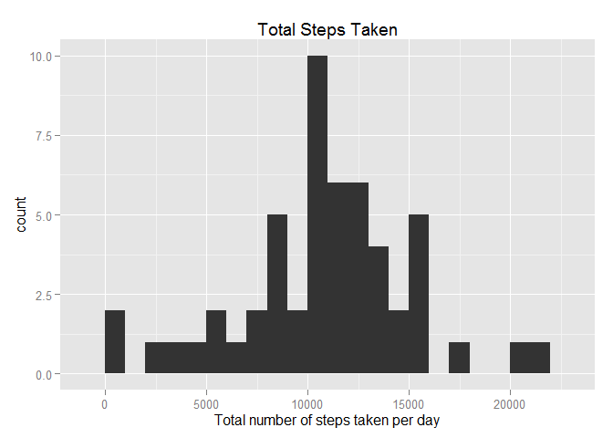
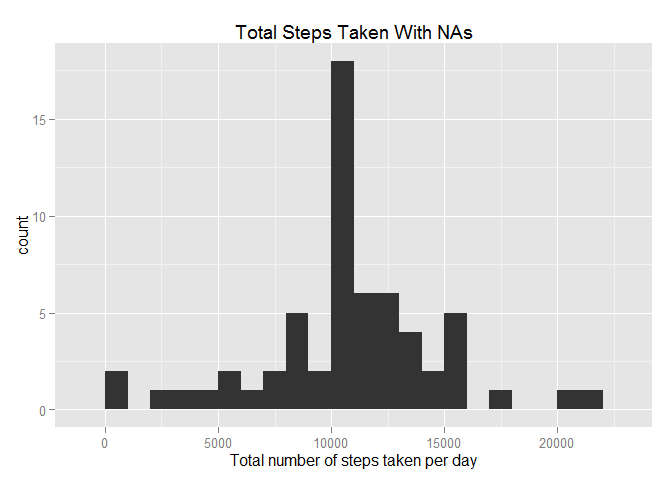
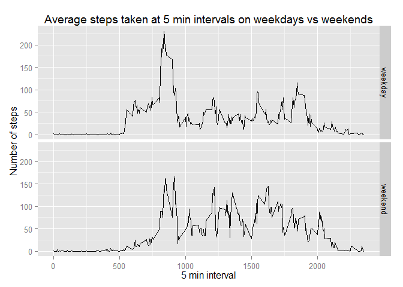

# Reproducible Research: Peer Assessment 1


## Loading and preprocessing the data


Here we will load the data from a zip file (activity.zip) in the working directory into R and prints the first five lines to demonstrate they exist.


```r
data <- read.csv(unzip("activity.zip"))
head(data)
```

```
##   steps       date interval
## 1    NA 2012-10-01        0
## 2    NA 2012-10-01        5
## 3    NA 2012-10-01       10
## 4    NA 2012-10-01       15
## 5    NA 2012-10-01       20
## 6    NA 2012-10-01       25
```


## What is mean total number of steps taken per day?


In this part, we will sum the total number of steps taken on each day and create a histogram to show the frequency of steps per day. Note this is not a bar chart of the steps taken "on" a particular day, this shows the distribution of the steps taken across all days. 


```r
if(require("ggplot2")) {
  library(ggplot2)
} else {
  install.packages("ggplot2")
  library(ggplot2)
}
```

```
## Loading required package: ggplot2
```

```r
totSteps <- aggregate(data$steps ~ data$date, data = data, FUN = sum)
names(totSteps) <- c("date", "steps")
ggplot(totSteps, aes(x = totSteps$steps)) + geom_histogram(binwidth = 1000) + xlab("Total number of steps taken per day") +ggtitle("Total Steps Taken")
```

 

Now we will calculate and show the mean and median for the total number of steps taken per day


```r
mean(totSteps$steps)
```

```
## [1] 10766
```

```r
median(totSteps$steps)
```

```
## [1] 10765
```

So we can say that across all days the average steps are 10766 and the median is 10765

## What is the average daily activity pattern?


We will make a time series plot of the 5 minute interval and average number of steps taken on all days. 


```r
avgAct <- aggregate(data$steps ~ data$interval, data = data, FUN = mean)
names(avgAct) <- c("interval", "avgSteps")
plot(x = avgAct$interval, y = avgAct$avgSteps, type = "l", main = "Average Activity at 5 minute Intervals", xlab = "5- min interval", ylab = "Average steps taken (averaged across all days)")
```

 

Now let us determine which 5 minute interval tends to have the most activity


```r
avgAct[which.max(avgAct$avgSteps),]
```

```
##     interval avgSteps
## 104      835    206.2
```

So we see the highest interval corresponds to the 835 minute mark with 206.2 steps

## Imputing missing values

Let's first see how many NA values are in the steps column of our data


```r
sum(is.na(data$steps))
```

```
## [1] 2304
```

Ok so we see 2304 NA values. What I'm going to do is get the average for each 5 minute interval across all days, then insert that average for each NA. So for example, if a 0 interval on any day is NA, I will replace that with the average (or expected value) of the 0 interval from all days in our set. 


```r
activityInterval <- aggregate(data$steps ~ data$interval, data = data, FUN = mean)
names(activityInterval) <- c("interval", "avgSteps")
newdata <- merge(data, activityInterval, by = "interval")
for(i in 1:length(newdata$steps)) {
     if(is.na(newdata[i,2])) {
         newdata[i,2] <- newdata[i,4]
     }
 }
totSteps2 <- aggregate(newdata$steps ~ newdata$date, data = newdata, FUN = sum)
names(totSteps2) <- c("date", "steps")
ggplot(totSteps2, aes(x = totSteps2$steps)) + geom_histogram(binwidth = 1000) + xlab("Total number of steps taken per day") +ggtitle("Total Steps Taken With NAs")
```

 

Now let's see the new mean and median for the data with the NAs filled in: 


```r
mean(totSteps2$steps)
```

```
## [1] 10766
```

```r
median(totSteps2$steps)
```

```
## [1] 10766
```

This is interesting: the mean is totally unchanged and the median has gone up by 1, meaning a very small change. The histogram shows significantly more values in the middle but no other major changes. This should make some intuitive sense: I replaced the NA values with mean values so we're just adding more to the most common values in the steps column. 


## Are there differences in activity patterns between weekdays and weekends?

Now I would like to take a look at activity on the weekend vs on the weekday. I'll add a new character vector called dayType and fill in with all "weekday"s. Then I'll use the weekdays function and coerce the date column (using as.Date()) to determine which days are actually weekends, and change the dayType character to the correct type (weekend).


```r
newdata$dayType <- c("weekday")
weekend <- weekdays(as.Date(newdata$date)) %in% c("Saturday", "Sunday")
newdata$dayType[weekend == TRUE] <- "weekend"
newdata$dayType <- as.factor(newdata$dayType)
```


```r
avgStepsWeek <- aggregate(steps ~ interval + dayType, data = newdata, FUN = mean)
ggplot(avgStepsWeek, aes(interval, steps)) + geom_line() + facet_grid(dayType~.) + xlab("5 min interval") + ylab("Number of steps") + ggtitle("Average steps taken at 5 min intervals on weekdays vs weekends")
```

 

Interestingly, there seems to be more activity in the earlier intervals of the day during the week than the weekend (I would guess because people sleep in but would need more investigation). There is also a large spike of activity during the week in the early part of the chart around the 700-800 mark. 
